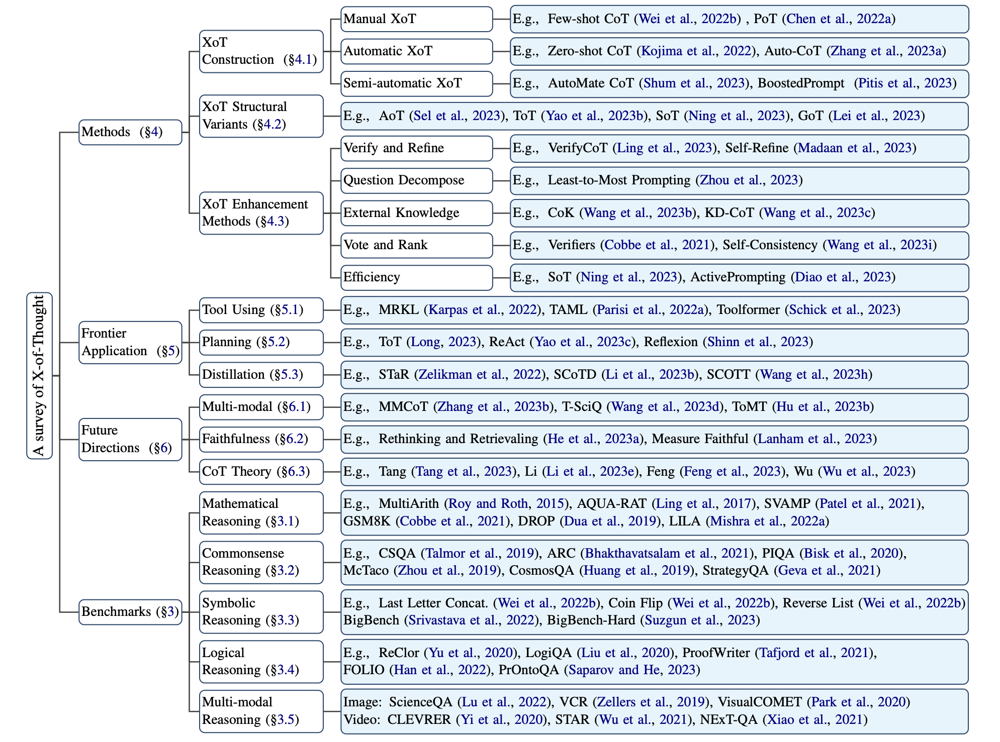
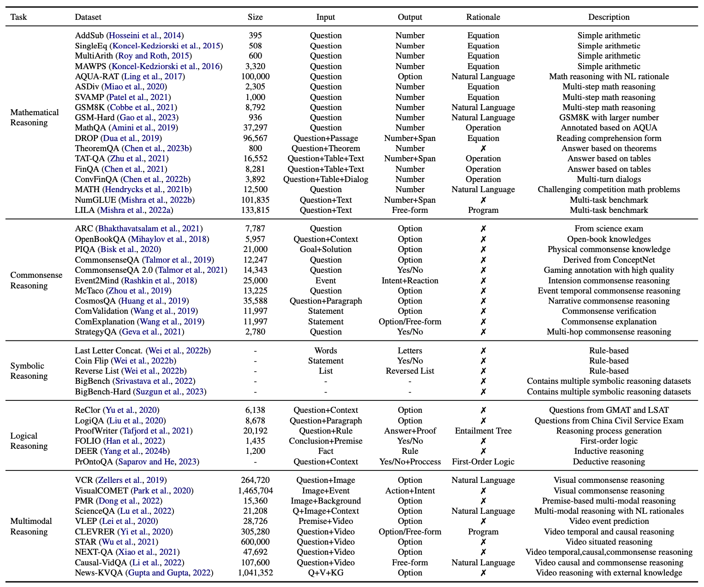
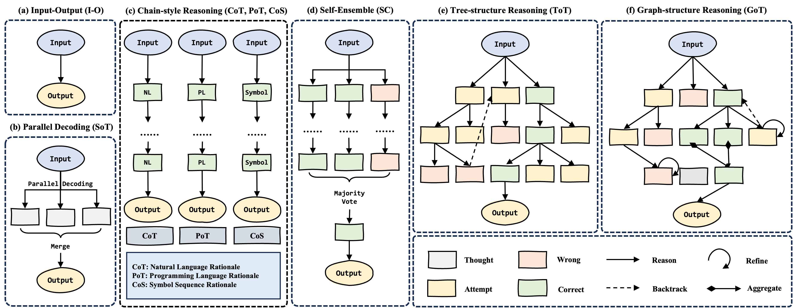
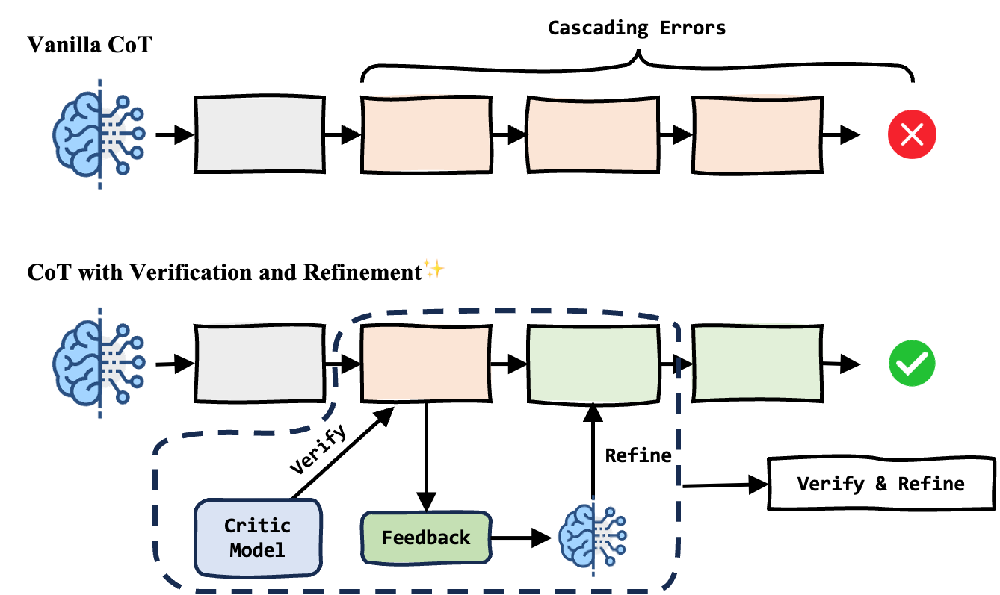
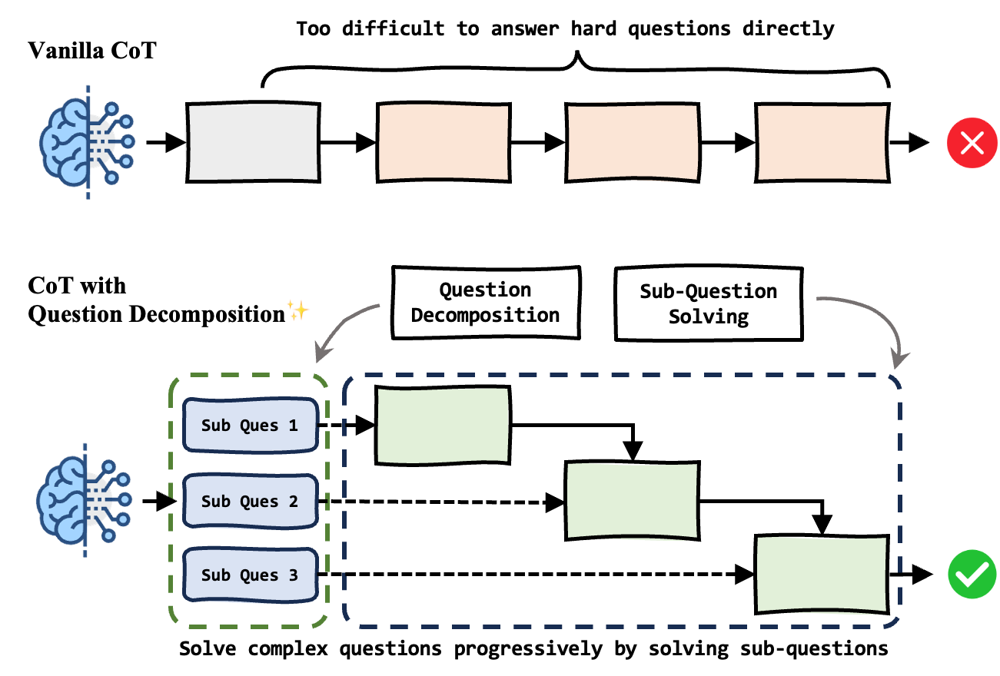
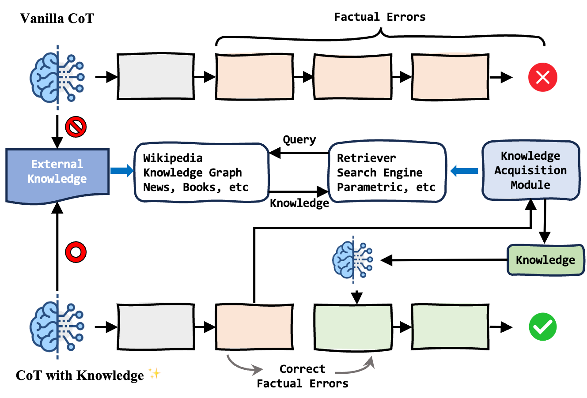
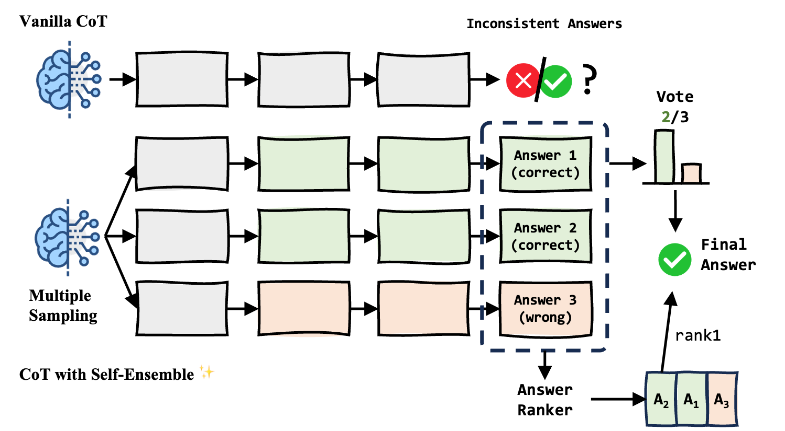

<div align="center">
<h1>
A Survey of Chain of Thought Reasoning:
Advances, Frontiers and Future
</h1>
</div>

<div align="center">
<b>Zheng Chu</b><sup>1∗</sup>,
<b>Jingchang Chen</b><sup>1∗</sup>,
<b>Qianglong Chen</b><sup>2∗</sup>,
<b>Weijiang Yu</b><sup>2</sup>,
<b>Tao He</b><sup>1</sup>,
<b>Haotian Wang</b><sup>1</sup>,
<b>Weihua Peng</b><sup>2</sup>,
<b>Ming Liu</b><sup>1†</sup>,
<b>Bing Qin</b><sup>1</sup>,
<b>Ting Liu</b><sup>1</sup>
</div>

<div align="center">
<sup>1</sup>Harbin Institute of Technology, Harbin, China
</div>
<div align="center">
<sup>2</sup>Huawei Inc., Shenzhen, China
</div>

<br />

<div align="center">
    <a href="https://doi.org/10.48550/arXiv.2309.15402"></a>
    <a href="https://github.com/zchuz/CoT-Reasoning-Survey"></a>
    <a href="https://github.com/zchuz/CoT-Reasoning-Survey/blob/main/LICENSE">  </a>
</div>

This repository contains the resources for paper **_A Survey of Chain of Thought Reasoning: Advances, Frontiers and Future_**



For more details, please refer to the paper: [A Survey of Chain of Thought Reasoning: Advances, Frontiers and Future](https://doi.org/10.48550/arXiv.2309.15402).

## 🎉 Updates

- 2023/10/17 The second version of our paper has been released, check it on [arxiv](https://doi.org/10.48550/arXiv.2309.15402).
- 2023/10/15 We have updated 44 papers in the reading list, and the v2 paper is on its way.
- 2023/09/27 The first version of our paper is available on [arxiv](https://doi.org/10.48550/arXiv.2309.15402).
- 2023/09/22 We created this reading list repository.

We use the 💡 icon to identify articles that have been added since the last version of the paper

This reading list will be updated periodically, and if you have any suggestions or find some we missed, feel free to contact us! You can submit an issue or send an email (zchu@ir.hit.edu.cn).


## 🎁 Resources

### Surveys

- **A Survey of Deep Learning for Mathematical Reasoning**, ACL 2023 [[paper](https://aclanthology.org/2023.acl-long.817)]
- **Reasoning with Language Model Prompting: A Survey**, ACL 2023 [[paper](https://aclanthology.org/2023.acl-long.294)]
- **A Survey for In-context Learning**, arXiv.2301.00234 [[paper](https://doi.org/10.48550/arXiv.2301.00234)]
- **A Survey of Large Language Models**, arXiv.2303.18223 [[paper](https://doi.org/10.48550/arXiv.2303.18223)]
- **Nature Language Reasoning, A Survey**, arXiv.2303.14725 [[paper](https://doi.org/10.48550/arXiv.2303.14725)]
- **A Survey on Evaluation of Large Language Models**, arXiv.2307.03109 [[paper](https://doi.org/10.48550/arXiv.2307.03109)] 💡
- **A Survey on Large Language Model based Autonomous Agents**, arXiv.2308.11432 [[paper](https://doi.org/10.48550/arXiv.2308.11432)] 💡
- **Siren’s Song in the AI Ocean: A Survey on Hallucination in Large Language Models**, arXiv.2309.01219 [[paper](https://doi.org/10.48550/arXiv.2309.01219)] 💡
- **Multimodal Foundation Models: From Specialists to General-Purpose Assistants**, arXiv.2309.10020 [[paper](https://doi.org/10.48550/arXiv.2309.10020)] 💡
- **Towards Better Chain-of-Thought Prompting Strategies: A Survey**, arXiv.2310.04959 [[paper](https://doi.org/10.48550/arXiv.2310.04959)] 💡
- **Survey on Factuality in Large Language Models: Knowledge, Retrieval and Domain-Specificity**, arXiv.2310.07521 [[paper](https://doi.org/10.48550/arXiv.2310.07521)] 💡

### Blogs

- **How does GPT Obtain its Ability? Tracing Emergent Abilities of Language Models to their Sources**, Dec 2022, Yao Fu’s Notion [[blog](https://yaofu.notion.site/How-does-GPT-Obtain-its-Ability-Tracing-Emergent-Abilities-of-Language-Models-to-their-Sources-b9a57ac0fcf74f30a1ab9e3e36fa1dc1)]
- **Towards Complex Reasoning: the Polaris of Large Language Models**, May 2023, Yao Fu’s Notion [[blog](https://yaofu.notion.site/Towards-Complex-Reasoning-the-Polaris-of-Large-Language-Models-c2b4a51355b44764975f88e6a42d4e75)]
- **Prompt Engineering**, March 2023, Lil’Log [[blog](https://lilianweng.github.io/posts/2023-03-15-prompt-engineering/)]
- **LLM Powered Autonomous Agents**, June 2023, Lil’Log [[blog](https://lilianweng.github.io/posts/2023-06-23-agent/)]

### Projects

- **HqWu-HITCS/Awesome-LLM-Survey**, [[project](https://github.com/HqWu-HITCS/Awesome-LLM-Survey)]
- **AGI-Edgerunners/LLM-Planning-Papers** [[project](https://github.com/AGI-Edgerunners/LLM-Planning-Papers)]

## 💯 Benchmarks



### Mathematical Reasoning

- **Learning to Solve Arithmetic Word Problems with Verb Categorization**, EMNLP 2014 [[paper](https://doi.org/10.3115/v1/d14-1058)]
- **Parsing Algebraic Word Problems into Equations**, TACL 2015 [[paper](https://aclanthology.org/Q15-1042)]
- **Solving General Arithmetic Word Problems**, EMNLP 2015 [[paper](https://aclanthology.org/D15-1202)]
- **MAWPS: A Math Word Problem Repository**, NAACL 2016 [[paper](https://doi.org/10.18653/v1/n16-1136)]
- **Program Induction by Rationale Generation: Learning to Solve and Explain Algebraic Word Problems**, ACL 2017 [[paper](https://doi.org/10.18653/v1/P17-1015)]
- **A Diverse Corpus for Evaluating and Developing English Math Word Problem Solvers**, ACL 2020 [[paper](https://aclanthology.org/2020.acl-main.92)]
- **Are NLP Models really able to Solve Simple Math Word Problems?**, ACL 2021 [[paper](https://doi.org/10.18653/v1/2021.naacl-main.168)]
- **Training Verifiers to Solve Math Word Problems**, arXiv.2110.14168 [[paper](https://doi.org/10.48550/arXiv.2110.14168)]
- **PAL: Program-aided Language Models**, ICML 2023 [[paper](https://proceedings.mlr.press/v202/gao23f.html)]
- **MathQA: Towards Interpretable Math Word Problem Solving with Operation-Based Formalisms**, NAACL 2019 [[paper](https://doi.org/10.18653/v1/n19-1245)]
- **DROP: A Reading Comprehension Benchmark Requiring Discrete Reasoning Over Paragraphs**, ACL 2019 [[paper](https://aclanthology.org/N19-1246)]
- **TheoremQA: A Theorem-driven Question Answering dataset**, EMNLP 2023 [[paper](https://doi.org/10.48550/arXiv.2305.12524)]
- **TAT-QA: A Question Answering Benchmark on a Hybrid of Tabular and Textual Content in Finance**, ACL 2021 [[paper](https://doi.org/10.18653/v1/2021.acl-long.254)]
- **FinQA: A Dataset of Numerical Reasoning over Financial Data**, EMNLP 2021 [[paper](https://doi.org/10.18653/v1/2021.emnlp-main.300)]
- **ConvFinQA: Exploring the Chain of Numerical Reasoning in Conversational Finance Question Answering**, EMNLP 2022 [[paper](https://doi.org/10.18653/v1/2022.emnlp-main.421)]
- **Measuring Mathematical Problem Solving With the MATH Dataset**, NeurIPS 2021 [[paper](https://datasets-benchmarks-proceedings.neurips.cc/paper/2021/hash/be83ab3ecd0db773eb2dc1b0a17836a1-Abstract-round2.html)]
- **NumGLUE: A Suite of Fundamental yet Challenging Mathematical Reasoning Tasks**, ACL 2022 [[paper](https://doi.org/10.18653/v1/2022.acl-long.246)]
- **LILA: A Unified Benchmark for Mathematical Reasoning**, EMNLP 2022 [[paper](https://doi.org/10.18653/v1/2022.emnlp-main.392)]

### Commonsense Reasoning

- **Think you have Solved Direct-Answer Question Answering? Try ARC-DA, the Direct-Answer AI@ Reasoning Challenge**, arXiv.2102.03315 [[paper](https://doi.org/10.48550/arXiv.2102.03315)]
- **Can a Suit of Armor Conduct Electricity? A New Dataset for Open Book Question Answering**, ACL 2018 [[paper](https://aclanthology.org/D18-1260)]
- **PIQA: Reasoning about Physical Commonsense in Natural Language**, AAAI 2020 [[paper](https://ojs.aaai.org/index.php/AAAI/article/view/6239)]
- **CommonsenseQA: A Question Answering Challenge Targeting Commonsense Knowledge**, NAACL 2019 [[paper](https://doi.org/10.18653/v1/n19-1421)]
- **CommonsenseQA 2.0: Exposing the Limits of AI through Gamification**, NeurIPS 2021 [[paper](https://datasets-benchmarks-proceedings.neurips.cc/paper/2021/hash/3ef815416f775098fe977004015c6193-Abstract-round1.html)]
- **Event2Mind: Commonsense Inference on Events, Intents, and Reactions**, ACL 2018 [[paper](https://aclanthology.org/P18-1043/)]
- **Going on a vacation" takes longer than "Going for a walk": A Study of Temporal Commonsense Understanding**, EMNLP 2019 [[paper](https://doi.org/10.18653/v1/D19-1332)]
- **Cosmos QA: Machine Reading Comprehension with Contextual Commonsense Reasoning**, EMNLP 2019 [[paper](https://doi.org/10.18653/v1/D19-1243)]
- **Does it Make Sense? And Why? A Pilot Study for Sense Making and Explanation**, ACL 2019 [[paper](https://aclanthology.org/P19-1393)]
- **Did Aristotle Use a Laptop? A Question Answering Benchmark with Implicit Reasoning Strategies**, TACL 2021 [[paper](https://doi.org/10.1162/tacl_a_00370)]
- **CRoW: Benchmarking Commonsense Reasoning in Real-World Tasks**, EMNLP 2023 [[paper](https://doi.org/10.48550/arXiv.2310.15239)] 💡

### Symbolic Reasoning

- **Chain-of-Thought Prompting Elicits Reasoning in Large Language Models**, NeurIPS 2022 [[paper](http://papers.nips.cc/paper_files/paper/2022/hash/9d5609613524ecf4f15af0f7b31abca4-Abstract-Conference.html)]
- **Beyond the Imitation Game: Quantifying and extrapolating the capabilities of language models**, arXiv.2206.04615 [[paper](https://doi.org/10.48550/arXiv.2206.04615)]
- **Challenging BIG-Bench Tasks and Whether Chain-of-Thought Can Solve Them**, ACL 2023 [[paper](https://doi.org/10.18653/v1/2023.findings-acl.824)]

### Logical Reasoning

- **ReClor: A Reading Comprehension Dataset Requiring Logical Reasoning**, ICLR 2020 [[paper](https://openreview.net/forum?id=HJgJtT4tvB)]
- **LogiQA: A Challenge Dataset for Machine Reading Comprehension with Logical Reasoning**, IJCAI 2020 [[paper](https://doi.org/10.24963/ijcai.2020/501)]
- **ProofWriter: Generating Implications, Proofs, and Abductive Statements over Natural Language**, ACL 2021 [[paper](https://doi.org/10.18653/v1/2021.findings-acl.317)]
- **FOLIO: Natural Language Reasoning with First-Order Logic**, arXiv.2209.00840 [[paper](https://doi.org/10.48550/arXiv.2209.00840)]
- **Language Models as Inductive Reasoners**, arXiv.2212.10923 [[paper](https://doi.org/10.48550/arXiv.2212.10923)]
- **Language Models Are Greedy Reasoners: A Systematic Formal Analysis of Chain-of-Thought**, ICLR 2023 [[paper](https://openreview.net/pdf?id=qFVVBzXxR2V)]

### Multi-modal Reasoning

#### Visual-Language (Image)

- **From Recognition to Cognition: Visual Commonsense Reasoning**, CVPR 2019 [[paper](http://openaccess.thecvf.com/content_CVPR_2019/html/Zellers_From_Recognition_to_Cognition_Visual_Commonsense_Reasoning_CVPR_2019_paper.html)]
- **VisualCOMET: Reasoning About the Dynamic Context of a Still Image**, ICCV 2020 [[paper](https://doi.org/10.1007/978-3-030-58558-7_30)]
- **Premise-based Multimodal Reasoning: Conditional Inference on Joint Textual and Visual Clues**, ACL 2022 [[paper](https://doi.org/10.18653/v1/2022.acl-long.66)]
- **Learn to Explain: Multimodal Reasoning via Thought Chains for Science Question Answering**, NeurIPS 2022 [[paper](http://papers.nips.cc/paper_files/paper/2022/hash/11332b6b6cf4485b84afadb1352d3a9a-Abstract-Conference.html)]

#### Video-Language

- **What is More Likely to Happen Next? Video-and-Language Future Event Prediction**, EMNLP 2020 [[paper](https://doi.org/10.18653/v1/2020.emnlp-main.706)]
- **CLEVRER: Collision Events for Video Representation and Reasoning**, ICLR 2020 [[paper](https://openreview.net/forum?id=HkxYzANYDB)]
- **NExT-QA: Next Phase of Question-Answering to Explaining Temporal Actions**, CVPR 2021 [[paper](https://openaccess.thecvf.com/content/CVPR2021/html/Xiao_NExT-QA_Next_Phase_of_Question-Answering_to_Explaining_Temporal_Actions_CVPR_2021_paper.html)]
- **STAR: A Benchmark for Situated Reasoning in Real-World Videos**, NeurIPS 2021 [[paper](https://datasets-benchmarks-proceedings.neurips.cc/paper/2021/hash/5ef059938ba799aaa845e1c2e8a762bd-Abstract-round2.html)]
- **From Representation to Reasoning: Towards both Evidence and Commonsense Reasoning for Video Question-Answering**, CVPR 2022 [[paper](https://doi.org/10.1109/CVPR52688.2022.02059)]
- **NewsKVQA: Knowledge-Aware News Video Question Answering**, PAKDD 2022 [[paper](https://doi.org/10.1007/978-3-031-05981-0_1)]

## 🚀 Advances

### XoT Construction

#### Manual Construction

- **Chain-of-Thought Prompting Elicits Reasoning in Large Language Models**, NeurIPS 2022 [[paper](http://papers.nips.cc/paper_files/paper/2022/hash/9d5609613524ecf4f15af0f7b31abca4-Abstract-Conference.html)]
- **PAL: Program-aided Language Models**, PMLR 2023 [[paper](https://proceedings.mlr.press/v202/gao23f.html)]
- **Program of Thoughts Prompting: Disentangling Computation from Reasoning for Numerical Reasoning Tasks**, arXiv.2211.12588 [[paper](https://doi.org/10.48550/arXiv.2211.12588)]
- **MathPrompter: Mathematical Reasoning using Large Language Models**, ACL 2023 [[paper](https://doi.org/10.18653/v1/2023.acl-industry.4)]
- **Complexity-Based Prompting for Multi-step Reasoning**, ICLR 2023 [[paper](https://openreview.net/pdf?id=yf1icZHC-l9)]

#### Automatic Construction

- **Large Language Models are Zero-Shot Reasoners**, NeurIPS 2022 [[paper](http://papers.nips.cc/paper_files/paper/2022/hash/8bb0d291acd4acf06ef112099c16f326-Abstract-Conference.html)]
- **Program of Thoughts Prompting: Disentangling Computation from Reasoning for Numerical Reasoning Tasks**, arXiv.2211.12588 [[paper](https://doi.org/10.48550/arXiv.2211.12588)]
- **Plan-and-Solve Prompting: Improving Zero-Shot Chain-of-Thought Reasoning by Large Language Models**, ACL 2023 [[paper](https://aclanthology.org/2023.acl-long.147)]
- **Automatic Chain of Thought Prompting in Large Language Models**, ICLR 2023 [[paper](https://openreview.net/pdf?id=5NTt8GFjUHkr)]
- **Reprompting: Automated Chain-of-Thought Prompt Inference Through Gibbs Sampling**, arXiv.2305.09993 [[paper](https://doi.org/10.48550/arXiv.2305.09993)]
- **Better Zero-Shot Reasoning with Self-Adaptive Prompting**, ACL 2023 [[paper](https://doi.org/10.48550/arXiv.2305.14106)] 💡
- **Enhancing Zero-Shot Chain-of-Thought Reasoning in Large Language Models through Logic**, arXiv.2309.13339 [[paper](https://doi.org/10.48550/arXiv.2309.13339)] 💡
- **Agent Instructs Large Language Models to be General Zero-Shot Reasoners**, arXiv.2310.03710 [[paper](https://doi.org/10.48550/arXiv.2310.03710)] 💡
- **PromptAgent: Strategic Planning with Language Models Enables Expert-level Prompt Optimization**, [[paper](https://doi.org/10.48550/arXiv.2310.16427)] 💡

#### Semi-Automatic Construction

- **Dynamic Prompt Learning via Policy Gradient for Semi-structured Mathematical Reasoning**, ICLR 2023 [[paper](https://openreview.net/pdf?id=DHyHRBwJUTN)]
- **Synthetic Prompting: Generating Chain-of-Thought Demonstrations for Large Language Models**, arXiv.2302.00618 [[paper](https://doi.org/10.48550/arXiv.2302.00618)]
- **Automatic Prompt Augmentation and Selection with Chain-of-Thought from Labeled Data**, EMNLP 2023 [[paper](https://doi.org/10.48550/arXiv.2302.12822)]
- **Explanation Selection Using Unlabeled Data for In-Context Learning**, arXiv.2302.04813 [[paper](https://doi.org/10.48550/arXiv.2302.04813)]
- **Boosted Prompt Ensembles for Large Language Models**, arXiv.2304.05970 [[paper](https://doi.org/10.48550/arXiv.2304.05970)]
- **Meta-CoT: Generalizable Chain-of-Thought Prompting in Mixed-task Scenarios with Large Language Models**, arXiv.2310.06692 [[paper](https://doi.org/10.48550/arXiv.2310.06692)] 💡
- **Self-prompted Chain-of-Thought on Large Language Models for Open-domain Multi-hop Reasoning**, EMNLP 2023 [[paper](https://doi.org/10.48550/arXiv.2310.13552)] 💡

### XoT Structural Variants



#### Chain Structure

- **Program of Thoughts Prompting: Disentangling Computation from Reasoning for Numerical Reasoning Tasks**, arXiv.2211.12588 [[paper](https://doi.org/10.48550/arXiv.2211.12588)]
- **PAL: Program-aided Language Models**, PMLR 2023 [[paper](https://proceedings.mlr.press/v202/gao23f.html)]
- **Chain-of-Symbol Prompting Elicits Planning in Large Langauge Models**, arXiv.2305.10276 [[paper](https://doi.org/10.48550/arXiv.2305.10276)]
- **Automatic Model Selection with Large Language Models for Reasoning**, EMNLP 2023 [[paper](https://doi.org/10.48550/arXiv.2305.14333)] 💡
- **Algorithm of Thoughts: Enhancing Exploration of Ideas in Large Language Models**, arXiv.2308.10379 [[paper](https://doi.org/10.48550/arXiv.2308.10379)]

#### Tree Structure

- **Large Language Model Guided Tree-of-Thought**, arXiv.2305.08291 [[paper](https://doi.org/10.48550/arXiv.2305.08291)]
- **Tree of Thoughts: Deliberate Problem Solving with Large Language Models**, NeurIPS 2023 [[paper](https://doi.org/10.48550/arXiv.2305.10601)]
- **Skeleton-of-Thought: Large Language Models Can Do Parallel Decoding**, arXiv.2307.15337 [[paper](https://doi.org/10.48550/arXiv.2307.15337)]
- **Tree of Uncertain Thoughts Reasoning for Large Language Models**, arXiv.2309.07694 [[paper](https://doi.org/10.48550/arXiv.2309.07694)] 💡
- **Thought Propagation: An Analogical Approach to Complex Reasoning with Large Language Models**, arXiv.2310.03965 [[paper](https://doi.org/10.48550/arXiv.2310.03965)] 💡
- **Autonomous Tree-search Ability of Large Language Models**, arXiv.2310.10686 [[paper](https://doi.org/10.48550/arXiv.2310.10686)] 💡

#### Graph Structure

- **Graph of Thoughts: Solving Elaborate Problems with Large Language Models**, arXiv.2308.09687 [[paper](https://doi.org/10.48550/arXiv.2308.09687)]
- **Boosting Logical Reasoning in Large Language Models through a New Framework: The Graph of Thought**, arXiv.2308.08614 [[paper](https://doi.org/10.48550/arXiv.2308.08614)]
- **Large Language Model Cascades with Mixture of Thoughts Representations for Cost-efficient Reasoning**, arXiv.2310.03094 [[paper](https://doi.org/10.48550/arXiv.2310.03094)] 💡
- **Resprompt: Residual Connection Prompting Advances Multi-Step Reasoning in Large Language Models**, arxix.2310.04743 [[paper](https://doi.org/10.48550/arXiv.2310.04743)] 💡

### XoT Enhancement Methods

#### Verify and Refine



- **Making Language Models Better Reasoners with Step-Aware Verifier**, ACL 2022 [[paper](https://api.semanticscholar.org/CorpusID:259370847)]
- **Successive Prompting for Decomposing Complex Questions**, EMNLP 2022 [[paper](https://doi.org/10.18653/v1/2022.emnlp-main.81)]
- **Verify-and-Edit: A Knowledge-Enhanced Chain-of-Thought Framework**, ACL 2023 [[paper](https://doi.org/10.18653/v1/2023.acl-long.320)]
- **Large language models are reasoners with self-verification**, arXiv.2212.09561 [[paper](https://doi.org/10.48550/arXiv.2212.09561)]
- **Reflexion: Language Agents with Verbal Reinforcement Learning**, NeurIPS 2023 [[paper](https://api.semanticscholar.org/CorpusID:258833055)]
- **Self-Refine: Iterative Refinement with Self-Feedback**, NeurIPS 2023 [[paper](https://doi.org/10.48550/arXiv.2303.17651)]
- **REFINER: Reasoning Feedback on Intermediate Representations**, arXiv.2304.01940 [[paper](https://doi.org/10.48550/arXiv.2304.01904)]
- **RCOT: Detecting and Rectifying Factual Inconsistency in Reasoning by Reversing Chain-of-Thought**, arXiv.2305.11499 [[paper](https://doi.org/10.48550/arXiv.2305.11499)]
- **Deductive Verification of Chain-of-Thought Reasoning**, NeurIPS 2023 [[paper](https://doi.org/10.48550/arXiv.2306.03872)]
- **Forward-Backward Reasoning in Large Language Models for Verification**, arXiv.2308.07758 [[paper](https://doi.org/10.48550/arXiv.2308.07758)]
- **SCREWS: A Modular Framework for Reasoning with Revisions**, arXiv.2309.13075 [[paper](https://doi.org/10.48550/arXiv.2309.13075)] 💡
- **Chain-of-Verification Reduces Hallucination in Large Language Models**, arXiv.2309.11495 [[paper](https://doi.org/10.48550/arXiv.2309.11495)] 💡
-  **Large Language Models Cannot Self-Correct Reasoning Yet**, arXiv.2310.01798 [[paper](https://doi.org/10.48550/arXiv.2310.01798)] 💡
- **Crystal: Introspective Reasoners Reinforced with Self-Feedback**, EMNLP 2023 [[paper](https://doi.org/10.48550/arXiv.2310.04921)] 💡
- **Take a Step Back: Evoking Reasoning via Abstraction in Large Language Models**, arXiv.2310.04921 [[paper](https://doi.org/10.48550/arXiv.2310.04921)] 💡
- **Towards Mitigating Hallucination in Large Language Models via Self-Reflection**, arXiv.2310.06271 [[paper](https://doi.org/10.48550/arXiv.2310.06271)] 💡
- **MAF: Multi-Aspect Feedback for Improving Reasoning in Large Language Models**, EMNLP 2023 [[paper](https://doi.org/10.48550/arXiv.2310.12426)] 💡
- **R^3 Prompting: Review, Rephrase and Resolve for Chain-of-Thought Reasoning in Large Language Models under Noisy Context**, EMNLP 2023 [[paper](https://doi.org/10.48550/arXiv.2310.16535)] 💡
- **Ask One More Time: Self-Agreement Improves Reasoning of Language Models in (Almost) All Scenarios**, arXiv.2311.08154 [[paper](https://doi.org/10.48550/arXiv.2311.08154)] 💡

#### Question Decomposition



- **Successive Prompting for Decomposing Complex Questions**, EMNLP 2022 [[paper](https://doi.org/10.18653/v1/2022.emnlp-main.81)]
- **Iteratively Prompt Pre-trained Language Models for Chain of Thought**, EMNLP 2022 [[paper](https://doi.org/10.18653/v1/2022.emnlp-main.174)]
- **Least-to-Most Prompting Enables Complex Reasoning in Large Language Models**, ICLR 2023 [[paper](https://openreview.net/pdf?id=WZH7099tgfM)]
- **Decomposed Prompting: A Modular Approach for Solving Complex Tasks**, ICLR 2023 [[paper](https://openreview.net/pdf?id=_nGgzQjzaRy)]
- **Binding Language Models in Symbolic Languages**, ICLR 2023 [[paper](https://openreview.net/pdf?id=lH1PV42cbF)]
- **Large Language Models are Versatile Decomposers: Decomposing Evidence and Questions for Table-based Reasoning**, SIGIR 2023 [[paper](https://doi.org/10.1145/3539618.3591708)]
- **The Art of SOCRATIC QUESTIONING: Zero-shot Multimodal Reasoning with Recursive Thinking and Self-Questioning**, arXiv.2305.14999 [[paper](https://doi.org/10.48550/arXiv.2305.14999)] 💡

#### External Knowledge



- **Chain-of-Dictionary Prompting Elicits Translation in Large Language Models**, arXiv.2305.06575 [[paper](https://doi.org/10.48550/arXiv.2305.06575)]
- **MoT: Pre-thinking and Recalling Enable ChatGPT to Self-Improve with Memory-of-Thoughts**, arXiv.2305.05181 [[paper](https://doi.org/10.48550/arXiv.2305.05181)]
- **Chain of Knowledge: A Framework for Grounding Large Language Models with Structured Knowledge Bases**, arXiv.2305.13269 [[paper](https://doi.org/10.48550/arXiv.2305.13269)]
- **Boosting Language Models Reasoning with Chain-of-Knowledge Prompting**, arXiv.2306.06427 [[paper](https://doi.org/10.48550/arXiv.2306.06427)]
- **Knowledge-Driven CoT: Exploring Faithful Reasoning in LLMs for Knowledge-intensive Question Answering**, arXiv.2308.13259 [[paper](https://doi.org/10.48550/arXiv.2308.13259)]
- **Chain-of-Note: Enhancing Robustness in Retrieval-Augmented Language Models**, arXiv.2311.09210 [[paper](https://doi.org/10.48550/arXiv.2311.09210)] 💡

#### Vote and Rank



- **Training Verifiers to Solve Math Word Problems**, arXiv.2110.14168 [[paper](https://doi.org/10.48550/arXiv.2110.14168)]
- **Self-Consistency Improves Chain of Thought Reasoning in Language Models**, ICLR 2023 [[paper](https://openreview.net/pdf?id=1PL1NIMMrw)]
- **Complexity-Based Prompting for Multi-step Reasoning**, ICLR 2023 [[paper](https://openreview.net/pdf?id=yf1icZHC-l9)]
- **Answering Questions by Meta-Reasoning over Multiple Chains of Thought**, EMNLP 2023 [[paper](https://doi.org/10.48550/arXiv.2304.13007)]
- **Discriminator-Guided Multi-step Reasoning with Language Models**, arXiv.2305.14934 [[paper](https://doi.org/10.48550/arXiv.2305.14934)] 💡
- **SelfCheck: Using LLMs to Zero-Shot Check Their Own Step-by-Step Reasoning**, arXiv.2308.00436 [[paper](https://doi.org/10.48550/arXiv.2308.00436)]
- **Diversity of Thought Improves Reasoning Abilities of Large Language Models**, arXiv.2310.07088 [[paper](https://doi.org/10.48550/arXiv.2310.07088)] 💡
- **Universal Self-Consistency for Large Language Model Generation**, arXiv.2311.17311 [[paper](https://doi.org/10.48550/arXiv.2311.17311)] 💡

#### Efficiency

- **Active Prompting with Chain-of-Thought for Large Language Models**, arXiv.2302.12246 [[paper](https://doi.org/10.48550/arXiv.2302.12246)]
- **Let's Sample Step by Step: Adaptive-Consistency for Efficient Reasoning with LLMs**, arXiv.2305.11860 [[paper](https://doi.org/10.48550/arXiv.2305.11860)]
- **Skeleton-of-Thought: Large Language Models Can Do Parallel Decoding**, arXiv.2307.15337 [[paper](https://doi.org/10.48550/arXiv.2307.15337)]
- **Draft & Verify: Lossless Large Language Model Acceleration via Self-Speculative Decoding**, arXiv.2309.08168 [[paper](https://doi.org/10.48550/arXiv.2309.08168)] 💡
- **Large Language Model Cascades with Mixture of Thoughts Representations for Cost-efficient Reasoning**, arXiv.2310.03094 [[paper](https://doi.org/10.48550/arXiv.2310.03094)] 💡

## 🛸 Frontier Application

### Tool Using

- **MRKL Systems: A modular, neuro-symbolic architecture that combines large language models, external knowledge sources and discrete reasoning**, arXiv.2205.00445 [[paper](https://api.semanticscholar.org/CorpusID:248496374)]
- **TALM: Tool Augmented Language Models**, arXiv.2205.12255 [[paper](https://doi.org/10.48550/arXiv.2205.12255)]
- **ReAct: Synergizing Reasoning and Acting in Language Models**, ICLR 2023 [[paper](https://openreview.net/pdf?id=WE_vluYUL-X)]
- **Toolformer: Language Models Can Teach Themselves to Use Tools**, NeurIPS 2023 [[paper](https://doi.org/10.48550/arXiv.2302.04761)]
- **ART: Automatic multi-step reasoning and tool-use for large language models**, arXiv.2303.09014 [[paper]( 	
  https://doi.org/10.48550/arXiv.2303.09014)] 💡
- **MM-REACT: Prompting ChatGPT for Multimodal Reasoning and Action**, arXiv.2303.11381 [[paper](https://doi.org/10.48550/arXiv.2303.11381)]
- **HuggingGPT: Solving AI Tasks with ChatGPT and its Friends in Hugging Face**, NeurIPS 2023 [[paper](https://api.semanticscholar.org/CorpusID:257833781)]
- **API-Bank: A Benchmark for Tool-Augmented LLMs**, EMNLP 2023 [[paper](https://api.semanticscholar.org/CorpusID:258179056)]
- **ToolkenGPT: Augmenting Frozen Language Models with Massive Tools via Tool Embeddings**, NeurIPS 2023 [[paper](https://doi.org/10.48550/arXiv.2305.11554)] 💡
- **On the Tool Manipulation Capability of Open-source Large Language Models**, arXiv.2305.16504 [[paper](https://doi.org/10.48550/arXiv.2305.16504)] 💡
- **Large Language Models as Tool Makers**, arXiv.2305.17126 [[paper](https://doi.org/10.48550/arXiv.2305.17126)] 💡
- **GEAR: Augmenting Language Models with Generalizable and Efficient Tool Resolution**, arXiv.2307.08775 [[paper](https://doi.org/10.48550/arXiv.2307.08775)] 💡
- **ToolLLM: Facilitating Large Language Models to Master 16000+ Real-world APIs**, arXiv.2307.16789 [[paper](https://doi.org/10.48550/arXiv.2307.16789)] 💡
- **Tool Documentation Enables Zero-Shot Tool-Usage with Large Language Models**, arXiv.2308.00675 [[paper](https://doi.org/10.48550/arXiv.2308.00675)] 💡
- **MINT: Evaluating LLMs in Multi-turn Interaction with Tools and Language Feedback**, arXiv.2309.10691 [[paper](https://doi.org/10.48550/arXiv.2309.10691)] 💡
- **Natural Language Embedded Programs for Hybrid Language Symbolic Reasoning**, arXiv.2309.10814 [[paper](https://doi.org/10.48550/arXiv.2309.10814)] 💡
- **MetaTool Benchmark: Deciding Whether to Use Tools and Which to Use**, arXiv.2310.03128 [[paper](https://doi.org/10.48550/arXiv.2310.03128)] 💡

### Planning

- **Large Language Models Still Can't Plan (A Benchmark for LLMs on Planning and Reasoning about Change)**, NeurIPS 2023 [[paper](https://doi.org/10.48550/arXiv.2206.10498)] 💡
- **Reflexion: Language Agents with Verbal Reinforcement Learning**, NeurIPS 2023 [[paper](https://doi.org/10.48550/arXiv.2303.11366)]
- **Self-Refine: Iterative Refinement with Self-Feedback**, NeurIPS 2023 [[paper](https://doi.org/10.48550/arXiv.2303.17651)]
- **LLM+P: Empowering Large Language Models with Optimal Planning Proficiency**, arXiv.2304.11477 [[paper](https://doi.org/10.48550/arXiv.2304.11477)]
- **Large Language Model Guided Tree-of-Thought**, arXiv.2305.08291 [[paper](https://doi.org/10.48550/arXiv.2305.08291)]
- **Tree of Thoughts: Deliberate Problem Solving with Large Language Models**, NeurIPS 2023 [[paper](https://doi.org/10.48550/arXiv.2305.10601)]
- **Reasoning with Language Model is Planning with World Model**, EMNLP 2023 [[paper](https://api.semanticscholar.org/CorpusID:258865812)]
- **On the Planning Abilities of Large Language Models -- A Critical Investigation**, NeurIPS 2023 [[paper](https://doi.org/10.48550/arXiv.2305.15771)] 💡
- **AdaPlanner: Adaptive Planning from Feedback with Language Models**, NeurIPS 2023 [[paper](https://doi.org/10.48550/arXiv.2305.16653)] 💡
- **Graph of Thoughts: Solving Elaborate Problems with Large Language Models**, arXiv.2308.09687 [[paper](https://doi.org/10.48550/arXiv.2308.09687)]
- **Boosting Logical Reasoning in Large Language Models through a New Framework: The Graph of Thought**, arXiv.2308.08614 [[paper](https://doi.org/10.48550/arXiv.2308.08614)]
- **Dynamic Planning with a LLM**, arXiv.2308.06391 [[paper](https://api.semanticscholar.org/CorpusID:260887774)]
- **ISR-LLM: Iterative Self-Refined Large Language Model for Long-Horizon Sequential Task Planning**, arXiv.2308.13724 [[paper](https://doi.org/10.48550/arXiv.2308.13724)] 💡
- **TPTU: Task Planning and Tool Usage of Large Language Model-based AI Agents**, arXiv.2308.03427 [[paper](https://doi.org/10.48550/arXiv.2308.03427)] 💡
- **You Only Look at Screens: Multimodal Chain-of-Action Agents**, arXiv.2309.11436 [[paper](https://doi.org/10.48550/arXiv.2309.11436)] 💡
- **Reason for Future, Act for Now: A Principled Framework for Autonomous LLM Agents with Provable Sample Efficiency**, arXiv.2309.17382 [[paper](https://doi.org/10.48550/arXiv.2309.17382)] 💡
- **ToRA: A Tool-Integrated Reasoning Agent for Mathematical Problem Solving**, arXiv.2309.17452 [[paper](https://doi.org/10.48550/arXiv.2309.17452)] 💡
- **Language Agent Tree Search Unifies Reasoning Acting and Planning in Language Models**, arXiv.2310.04406 [[paper](https://doi.org/10.48550/arXiv.2310.04406)] 💡
- **Tree-Planner: Efficient Close-loop Task Planning with Large Language Models**, arXiv.2310.08582 [[paper](https://doi.org/10.48550/arXiv.2310.08582)] 💡
- **Reverse Chain: A Generic-Rule for LLMs to Master Multi-API Planning**, arXiv.2310.04474 [[paper](https://doi.org/10.48550/arXiv.2310.04474)] 💡
- **Eliminating Reasoning via Inferring with Planning: A New Framework to Guide LLMs' Non-linear Thinking**, arXiv.2310.12342 [[paper](https://doi.org/10.48550/arXiv.2310.12342)] 💡
- **ToolChain\*: Efficient Action Space Navigation in Large Language Models with A* Search**, arXiv.2310.13227 [[paper](https://doi.org/10.48550/arXiv.2310.13227)] 💡
- **Plan, Verify and Switch: Integrated Reasoning with Diverse X-of-Thoughts**, EMNLP 2023 [[paper](https://doi.org/10.48550/arXiv.2310.14628)] 💡
- **TPTU-v2: Boosting Task Planning and Tool Usage of Large Language Model-based Agents in Real-world Systems**, arXiv.2311.11315 [[paper](https://doi.org/10.48550/arXiv.2311.11315)] 💡

### Distillation

- **STaR: Bootstrapping Reasoning With Reasoning**, NeurIPS 2022 [[paper](http://papers.nips.cc/paper_files/paper/2022/hash/639a9a172c044fbb64175b5fad42e9a5-Abstract-Conference.html)]
- **Large Language Models Can Self-Improve**, EMNLP 2023 [[paper](https://doi.org/10.48550/arXiv.2210.11610)]
- **Teaching Small Language Models to Reason**, ACL 2023 [[paper](https://doi.org/10.18653/v1/2023.acl-short.151)]
- **Large Language Models Are Reasoning Teachers**, ACL 2023 [[paper](https://doi.org/10.18653/v1/2023.acl-long.830)]
- **Symbolic Chain-of-Thought Distillation: Small Models Can Also “Think” Step-by-Step**, ACL 2023 [[paper](https://doi.org/10.18653/v1/2023.acl-long.150)]
- **SCOTT: Self-Consistent Chain-of-Thought Distillation**, ACL 2023 [[paper](https://api.semanticscholar.org/CorpusID:258461058)]
- **Specializing Smaller Language Models towards Multi-Step Reasoning**, ICML 2023 [[paper](https://api.semanticscholar.org/CorpusID:256390607)]
- **Distilling Step-by-Step! Outperforming Larger Language Models with Less Training Data and Smaller Model Sizes**, arXiv.2305.02301 [[paper](https://api.semanticscholar.org/CorpusID:258461606)]
- **Contrastive Decoding: Open-ended Text Generation as Optimizatio**, ACL 2023 [[paper](https://doi.org/10.18653/v1/2023.acl-long.687)]
- **Contrastive Decoding Improves Reasoning in Large Language Models**, arXiv.2309.09117 [[paper](https://api.semanticscholar.org/CorpusID:261884427)]
- **Chain-of-Thought Reasoning is a Policy Improvement Operator**, arXiv.2309.08589 [[paper](
  https://doi.org/10.48550/arXiv.2309.08589)] 💡
- **Design of Chain-of-Thought in Math Problem Solving**, arXiv.2309.11054 [[paper](
  https://doi.org/10.48550/arXiv.2309.11054)] 💡
- **DialCoT Meets PPO: Decomposing and Exploring Reasoning Paths in Smaller Language Models**, arXiv.2310.05074 [[paper](
  https://doi.org/10.48550/arXiv.2310.05074)] 💡
- **Guiding Language Model Reasoning with Planning Tokens**, arXiv.2310.05707 [[paper](https://doi.org/10.48550/arXiv.2310.05707)] 💡
- **Democratizing Reasoning Ability: Tailored Learning from Large Language Model**, EMNLP 2023 [[paper](https://doi.org/10.48550/arXiv.2310.13332)] 💡
- **Teaching Language Models to Self-Improve through Interactive Demonstrations**, arXiv.2310.13522 [[paper](https://doi.org/10.48550/arXiv.2310.13522)] 💡
- **Implicit Chain of Thought Reasoning via Knowledge Distillation**, arXiv.2311.01460 [[paper](https://doi.org/10.48550/arXiv.2311.01460)] 💡

## 🔭 Future Prospect

### Multi-modal XoT

- **Multimodal Chain-of-Thought Reasoning in Language Models**, arXiv.2302.00923 [[paper](https://doi.org/10.48550/arXiv.2302.00923)]
- **Beyond Chain-of-Thought, Effective Graph-of-Thought Reasoning in Large Language Models**, arXiv.2305.16582 [[paper](https://doi.org/10.48550/arXiv.2305.16582)]
- **T-SciQ: Teaching Multimodal Chain-of-Thought Reasoning via Large Language Model Signals for Science Question Answering**, arXiv.2305.03453 [[paper](https://doi.org/10.48550/arXiv.2305.03453)]
- **Thinking Like an Expert:Multimodal Hypergraph-of-Thought (HoT) Reasoning to boost Foundation Modals**, arXiv.2308.06207 [[paper](https://doi.org/10.48550/arXiv.2308.06207)]
- **Tree-of-Mixed-Thought: Combining Fast and Slow Thinking for Multi-hop Visual Reasoning**, arXiv.2308.0965 [[paper](https://doi.org/10.48550/arXiv.2308.09658)]

### Faithful XoT

- **Verify-and-Edit: A Knowledge-Enhanced Chain-of-Thought Framework**, ACL 2023 [[paper](https://doi.org/10.18653/v1/2023.acl-long.320)]
- **Rethinking with Retrieval: Faithful Large Language Model Inference**, arXiv.2301.00303 [[paper](https://doi.org/10.48550/arXiv.2301.00303)]
- **How language model hallucinations can snowball**, arXiv.2305.13534 [[paper](https://doi.org/10.48550/arXiv.2305.13534)] 💡
- **Faithful Chain-of-Thought Reasoning**, arXiv.2301.13379 [[paper](https://doi.org/10.48550/arXiv.2301.13379)]
- **Boosting Language Models Reasoning with Chain-of-Knowledge Prompting**, arXiv.2306.06427 [[paper](https://doi.org/10.48550/arXiv.2306.06427)]
- **Question Decomposition Improves the Faithfulness of Model-Generated Reasoning**, arXiv.2307.11768 [[paper](https://doi.org/10.48550/arXiv.2307.11768)]
- **Measuring Faithfulness in Chain-of-Thought Reasoning**, arXiv.2307.13702 [[paper](https://doi.org/10.48550/arXiv.2307.13702)]
- **Chain of Natural Language Inference for Reducing Large Language Model Ungrounded Hallucinations**, arXiv.2310.03951 [[paper](https://doi.org/10.48550/arXiv.2310.03951)] 💡
- **Teaching Language Models to Hallucinate Less with Synthetic Tasks**, 	arXiv:2310.06827 [[paper](
https://doi.org/10.48550/arXiv.2310.06827)] 💡

### CoT Theory

- **Text and Patterns: For Effective Chain of Thought, It Takes Two to Tango**, arXiv.2209.07686 [[paper](https://doi.org/10.48550/arXiv.2209.07686)]
- **Language Models of Code are Few-Shot Commonsense Learners**, EMNLP 2022 [[paper](https://doi.org/10.18653/v1/2022.emnlp-main.90)] 💡
- **Towards Understanding Chain-of-Thought Prompting: An Empirical Study of What Matters**, ACL 2023 [[paper](https://doi.org/10.18653/v1/2023.acl-long.153)]
- **Exploring the Curious Case of Code Prompts**, arXiv.2304.13250 [[paper](https://doi.org/10.48550/arXiv.2304.13250)] 💡
- **Large Language Models are In-Context Semantic Reasoners rather than Symbolic Reasoners**, arXiv.2305.14825 [[paper](https://doi.org/10.48550/arXiv.2305.14825)]
- **Dissecting Chain-of-Thought: A Study on Compositional In-Context Learning of MLPs**, arXiv.2305.18869 [[paper](https://doi.org/10.48550/arXiv.2305.18869)]
- **Towards Revealing the Mystery behind Chain of Thought: a TheoreticalPerspective**, NeurIPS 2023 [[paper](https://doi.org/10.48550/arXiv.2305.15408)]
- **Analyzing Chain-of-Thought Prompting in Large Language Models via Gradient-based Feature Attributions**, arXiv.2307.13339 [[paper](https://doi.org/10.48550/arXiv.2307.13339)]
- **The Expressive Power of Transformers with Chain of Thought**, arXiv.2310.07923 [[paper](https://doi.org/10.48550/arXiv.2310.07923)] 💡
- **Why Can Large Language Models Generate Correct Chain-of-Thoughts?**, arXiv.2310.13571 [[paper](https://doi.org/10.48550/arXiv.2310.13571)] 💡

## 🚢 Other works

- **The Unreliability of Explanations in Few-Shot In-Context Learning**, arXiv.2205.03401 [[paper](https://doi.org/10.48550/arXiv.2205.03401)]
- **A Dataset and Benchmark for Automatically Answering and Generating Machine Learning Final Exams**, arXiv.2206.05442 [[paper](https://doi.org/10.48550/arXiv.2206.05442)]
- **Rationale-Augmented Ensembles in Language Models**, arXiv.2207.00747 [[paper](https://doi.org/10.48550/arXiv.2207.00747)]
- **Can language models learn from explanations in context?**, EMNLP 2022 [[paper](https://doi.org/10.18653/v1/2022.findings-emnlp.38)]
- **Inferring Implicit Relations in Complex Questions with Language Models**, EMNLP 2022 [[paper](https://doi.org/10.18653/v1/2022.findings-emnlp.188)]
- **Language Models of Code are Few-Shot Commonsense Learners**, EMNLP 2022 [[paper](https://doi.org/10.18653/v1/2022.emnlp-main.90)]
- **Solving Quantitative Reasoning Problems with Language Models**, NeurIPS 2022 [[paper](http://papers.nips.cc/paper_files/paper/2022/hash/18abbeef8cfe9203fdf9053c9c4fe191-Abstract-Conference.html)]
- **JiuZhang: A Chinese Pre-trained Language Model for Mathematical Problem Understanding**, SIGKDD 2022 [[paper](https://doi.org/10.1145/3534678.3539131)]
- **Large Language Models are few(1)-shot Table Reasoners**, EACL 2023 [[paper](https://aclanthology.org/2023.findings-eacl.83)]
- **Reasoning Implicit Sentiment with Chain-of-Thought Prompting**, ACL 2023 [[paper](https://doi.org/10.18653/v1/2023.acl-short.101)]
- **Element-aware Summarization with Large Language Models: Expert-aligned Evaluation and Chain-of-Thought Method**, ACL 2023 [[paper](https://doi.org/10.18653/v1/2023.acl-long.482)]
- **Tab-CoT: Zero-shot Tabular Chain of Thought**, ACL 2023 [[paper](https://doi.org/10.18653/v1/2023.findings-acl.651)]
- **Recursion of Thought: A Divide-and-Conquer Approach to Multi-Context Reasoning with Language Models**, ACL 2023 [[paper](https://doi.org/10.18653/v1/2023.findings-acl.40)]
- **Language models are multilingual chain-of-thought reasoners**, ICLR 2023 [[paper](https://openreview.net/pdf?id=fR3wGCk-IXp)]
- **Ask Me Anything: A simple strategy for prompting language models**, ICLR 2023 [[paper](https://openreview.net/pdf?id=bhUPJnS2g0X)]
- **Large Language Models Can Be Easily Distracted by Irrelevant Context**, ICLR 2023 [[paper](https://proceedings.mlr.press/v202/shi23a.html)]
- **CoT-BERT: Enhancing Unsupervised Sentence Representation through Chain-of-Thought**, arXiv.2309.11143 [[paper](https://doi.org/10.48550/arXiv.2309.11143)] 💡
- **Three Questions Concerning the Use of Large Language Models to Facilitate Mathematics Learning**, EMNLP 2023 [[paper](https://doi.org/10.48550/arXiv.2310.13615)] 💡

## 📝 Citation

If you find our work helpful, you can cite this paper as:

```bibtex
@misc{chuCoTReasoningSurvey2023,
      title={A Survey of Chain of Thought Reasoning: Advances, Frontiers and Future}, 
      author={Zheng Chu and Jingchang Chen and Qianglong Chen and Weijiang Yu and Tao He and Haotian Wang and Weihua Peng and Ming Liu and Bing Qin and Ting Liu},
      year={2023},
      eprint={2309.15402},
      archivePrefix={arXiv},
      primaryClass={cs.CL}
}
```


